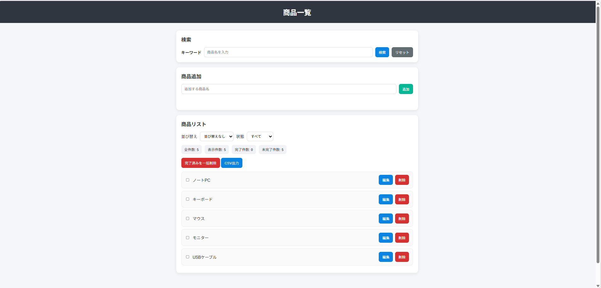
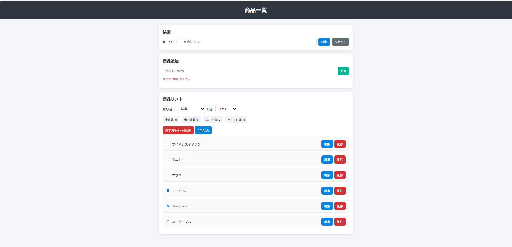
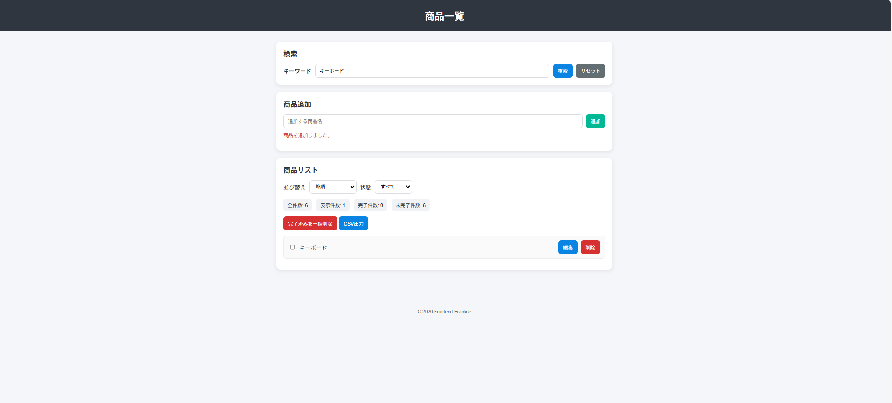

# Frontend Practice

商品管理ができるフロントエンド学習用アプリです。  
HTML / CSS / JavaScript を使って作成しました。

## 公開URL
https://hayata-86.github.io/frontend-practice/

## 画面イメージ

### 通常画面

### 商品追加の画面

### フィルター・完了状態の画面

## 制作背景
フロントエンド開発未経験の状態から、  
HTML / CSS / JavaScript の基礎を、実際に動くアプリを作りながら学ぶことを目的に制作しました。

単なる静的ページではなく、  
「追加・削除・編集・検索・並び替え・保存」まで含めたアプリを作ることで、  
DOM操作や状態管理の考え方を身につけることを意識しました。

## 主な機能
- 商品追加
- 商品削除
- 商品編集
- 商品検索
- 並び替え（昇順 / 降順）
- 状態フィルター（すべて / 未完了 / 完了済み）
- 完了チェック
- 完了済み一括削除
- 件数表示
- localStorage保存
- CSVエクスポート

## 使用技術
- HTML
- CSS
- JavaScript
- Git / GitHub
- GitHub Pages

## 工夫した点
- 検索、並び替え、状態フィルターを組み合わせて操作できるようにした
- localStorage を使って、再読み込み後も状態が残るようにした
- CSV出力機能を追加して、データを外部に出せるようにした
- 完了済みフラグや件数表示を入れて、一覧管理しやすくした
- 編集、削除、一括削除など複数の操作があってもUIが破綻しないように整理した

## 苦労した点
- フォーム送信時のリロード制御
- DOM操作での要素生成とイベント付与
- 検索状態を保ったまま並び替えやフィルターを適用する処理
- localStorage に保存するデータ構造を、文字列配列からオブジェクト配列へ変更したこと
- Git / GitHub で画像やファイル名変更を正しく反映すること

## 学んだこと
- `addEventListener` を使ったイベント処理の基本
- `filter`、`map`、`some` など配列操作の使い方
- localStorage を使ったブラウザ保存
- UIとデータを同期して再描画する考え方
- Gitで変更を管理し、GitHub Pagesで公開する流れ

## 開発期間
約10日  
（学習しながら段階的に機能追加を行い、少しずつ改善しました）

## 今後追加したい機能
- CSVインポート
- ドラッグ＆ドロップ並び替え
- ダークモード
- Reactでの再実装

## 学習目的
フロントエンド未経験の状態から、  
HTML / CSS / JavaScript の基礎を、実際に動くアプリを作りながら学ぶことを目的に制作しました。